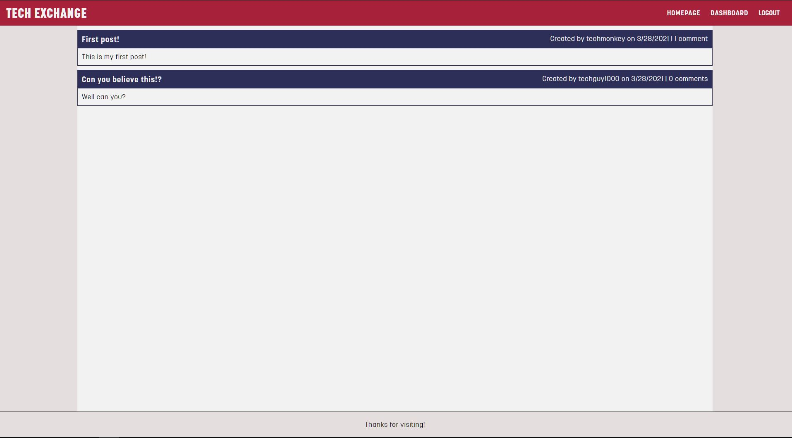
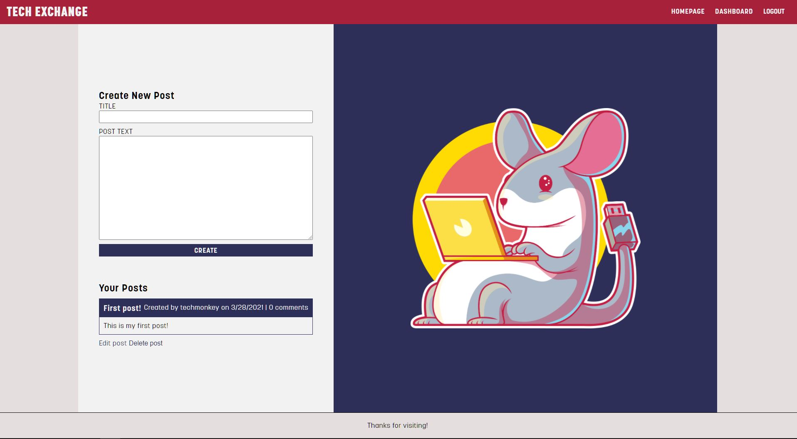
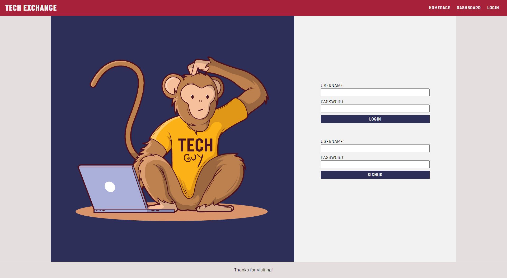

# Tech Exchange

## Table of Contents
* [Description](#description)
* [Deployed Application](#deployed)
* [The Challenge](#challenge)
* [The Criteria](#criteria)
* [Usage](#usage)

## Description 
CMS-style blog site for publishing articles, thoughts, and opinions

## Deployed Application 
[Tech Exchange](https://tech-exchange-cms.herokuapp.com/)

## The Challenge 
AS A developer who writes about tech I WANT a CMS-style blog site SO THAT I can publish articles, blog posts, and my thoughts and opinions

## The Criteria 
GIVEN a CMS-style blog site
1. WHEN I visit the site for the first time
    * THEN I am presented with the homepage, which includes existing blog posts if any have been posted; navigation links for the homepage and the dashboard; and the option to log in
1. WHEN I click on the homepage option
    * THEN I am taken to the homepage
1. WHEN I click on any other links in the navigation
    * THEN I am prompted to either sign up or sign in
1. WHEN I choose to sign up
    * THEN I am prompted to create a username and password
1. WHEN I click on the sign-up button
    * THEN my user credentials are saved and I am logged into the site
1. WHEN I revisit the site at a later time and choose to sign in
    * THEN I am prompted to enter my username and password
1. WHEN I am signed in to the site
    * THEN I see navigation links for the homepage, the dashboard, and the option to log out
1. WHEN I click on the homepage option in the navigation
    * THEN I am taken to the homepage and presented with existing blog posts that include the post title and the date created
1. WHEN I click on an existing blog post
    * THEN I am presented with the post title, contents, post creator’s username, and date created for that post and have the option to leave a comment
1. WHEN I enter a comment and click on the submit button while signed in
    * THEN the comment is saved and the post is updated to display the comment, the comment creator’s username, and the date created
1. WHEN I click on the dashboard option in the navigation
    * THEN I am taken to the dashboard and presented with any blog posts I have already created and the option to add a new blog post
1. WHEN I click on the button to add a new blog post
    * THEN I am prompted to enter both a title and contents for my blog post
1. WHEN I click on the button to create a new blog post
    * THEN the title and contents of my post are saved and I am taken back to an updated dashboard with my new blog post
1. WHEN I click on one of my existing posts in the dashboard
    * THEN I am able to delete or update my post and taken back to an updated dashboard
1. WHEN I click on the logout option in the navigation
    * THEN I am signed out of the site
1. WHEN I am idle on the page for more than a set time
    * THEN I am automatically signed out of the site 

## Usage 
ISC License

Copyright (c) 2021 Ian Jackson

Permission to use, copy, modify, and/or distribute this software for any purpose with or without fee is hereby granted, provided that the above copyright notice and this permission notice appear in all copies.

THE SOFTWARE IS PROVIDED "AS IS" AND THE AUTHOR DISCLAIMS ALL WARRANTIES WITH REGARD TO THIS SOFTWARE INCLUDING ALL IMPLIED WARRANTIES OF MERCHANTABILITY AND FITNESS. IN NO EVENT SHALL THE AUTHOR BE LIABLE FOR ANY SPECIAL, DIRECT, INDIRECT, OR CONSEQUENTIAL DAMAGES OR ANY DAMAGES WHATSOEVER RESULTING FROM LOSS OF USE, DATA OR PROFITS, WHETHER IN AN ACTION OF CONTRACT, NEGLIGENCE OR OTHER TORTIOUS ACTION, ARISING OUT OF OR IN CONNECTION WITH THE USE OR PERFORMANCE OF THIS SOFTWARE.